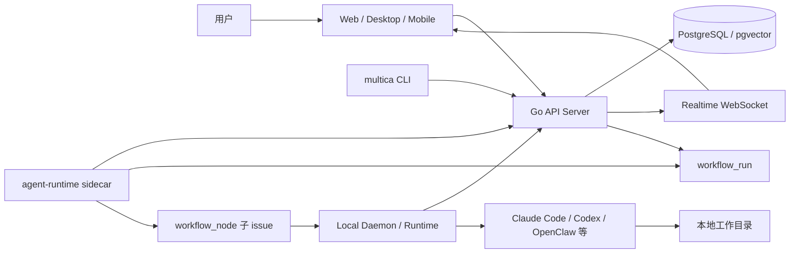

# Simultica

**Simultica 是从 Multica 分叉出来的人机协作与 Agent Workflow 编排平台。** 它保留 Multica 的 issue、agent、runtime、skill、chat、inbox 等协作基础，并在此基础上补充多节点 workflow 编排能力，让一次复杂任务可以被拆成多个可追踪、可恢复、可协同的 Agent 执行节点。

> 历史说明：仓库内仍保留不少 `Multica`、`@multica/*`、`multica` CLI、`github.com/multica-ai/multica` 等命名。这些属于上游兼容层，改名需要统一处理包名、二进制、配置、镜像和历史数据。

## 项目定位

**Simultica 的核心定位是“人 + AI Agent 共用同一套任务系统”。** 用户用 issue 描述目标，把任务分配给人或 agent；agent 通过本地 daemon/runtime 执行任务，并把进度、评论、状态和结果回写到平台。

相比直接在终端里使用单个 coding agent，Simultica 更关注这些问题：

- 多个 agent 同时工作时，如何在一个工作区里看见任务、状态和结果。
- 一个复杂任务被拆成多个步骤后，如何让每个步骤都有明确节点状态。
- agent 的执行上下文、skill、workflow 定义和历史结果如何沉淀下来。
- 本地 runtime、服务端、前端 GUI 之间如何保持进度一致。

## 核心能力

**平台能力围绕协作对象、执行运行时和 workflow 编排展开。**

| 能力 | 说明 |
|---|---|
| Workspace | 多工作区隔离，工作区内管理 issue、agent、runtime、skill、project 和成员。 |
| Issue | 核心任务对象，支持状态、优先级、评论、附件、订阅、子任务、依赖和指派。 |
| Agent | AI 工作者，像人一样可以被指派 issue、发表评论、创建任务和执行 workflow 节点。 |
| Runtime / Daemon | 本地执行环境，负责发现 coding CLI、领取任务、运行 agent 并回写结果。 |
| Skill | 工作区级可复用能力说明，可挂载文档、上下文和 `workflow.yaml`。 |
| Workflow Run | Simultica 新增的编排进度真相源，记录节点状态、当前节点、定义快照和错误信息。 |
| Realtime | 通过 WebSocket 推送 issue、inbox、runtime、workflow run 等实时更新。 |
| Web / Desktop / Mobile | Web 是主工作台，Desktop 提供桌面端体验，Mobile 提供移动端协作入口。 |

## 架构概览

**`workflow_run` 是 Simultica 编排链路里的进度真相源。** sidecar 或 runtime workflow 执行器负责推进节点，后端负责持久化与广播，前端只读取和渲染状态。



核心链路：

1. 用户在 issue 中描述任务，或由 agent / autopilot 创建 issue。
2. agent 被指派后，本地 daemon 从服务端领取任务。
3. 如果匹配带 `workflow.yaml` 的 skill，agent 可通过 `multica workflow submit` 提交 runtime workflow。
4. sidecar / runtime workflow 执行器创建并更新 `workflow_run`。
5. 后端通过 API 和 WebSocket 向 GUI 暴露最新节点状态。
6. 子节点执行完成后，主 issue 汇总 workflow 输出。

## 技术栈

**这是一个 Go 后端 + pnpm monorepo 前端的全栈仓库。**

| 层级 | 技术 |
|---|---|
| 后端 | Go、Chi、sqlc、pgx、gorilla/websocket、Cobra CLI |
| 数据库 | PostgreSQL、pgvector，Redis 可选用于实时广播、缓存和限流 |
| Web | Next.js App Router、React、TanStack Query、Zustand、Tiptap |
| Desktop | Electron、electron-vite、React |
| Mobile | Expo、React Native、expo-router |
| UI | `packages/ui`、Base UI、shadcn 风格组件、Tailwind |
| 工程化 | pnpm workspace、Turborepo、Vitest、Playwright |

## 快速开始

**本地开发优先使用 Makefile，它会串联依赖安装、数据库准备、迁移和服务启动。**

前置依赖：

- Node.js 与 pnpm 10.x
- Go 1.26.x
- Docker 或本机 PostgreSQL
- 可选：Redis、Playwright 浏览器依赖、各类 coding agent CLI

初始化环境：

```bash
cp .env.example .env
make setup
```

启动后端和 Web 前端：

```bash
make start
```

也可以使用一键开发入口：

```bash
make dev
```

默认地址：

| 服务 | 地址 |
|---|---|
| Web 前端 | `http://localhost:3000` |
| Go API | `http://localhost:8080` |
| WebSocket | `ws://localhost:8080/ws` |
| PostgreSQL | `localhost:5432` |

停止本地进程：

```bash
make stop
```

## 常用命令

**日常开发命令集中在根目录 `Makefile` 和 `package.json`。**

| 命令 | 作用 |
|---|---|
| `make help` | 查看可用 Make 目标。 |
| `make setup` | 安装依赖、准备数据库、执行迁移。 |
| `make start` | 启动 Go 后端和 Web 前端。 |
| `make server` | 只启动 Go API server。 |
| `make multica ARGS="..."` | 从源码运行 `multica` CLI。 |
| `make daemon` | 使用本地 profile 重启 daemon。 |
| `make migrate-up` | 执行数据库迁移。 |
| `make sqlc` | 重新生成 sqlc 代码。 |
| `pnpm dev:web` | 只启动 Web 前端。 |
| `pnpm dev:desktop` | 启动桌面端开发模式。 |
| `pnpm dev:mobile` | 启动移动端开发模式。 |
| `pnpm typecheck` | 执行 TypeScript 类型检查。 |
| `pnpm test` | 执行 TypeScript 单元测试。 |
| `make test` | 执行 Go 测试。 |
| `make check` | 执行完整校验：类型检查、单测、Go 测试和 Playwright E2E。 |

## 目录结构

**仓库按运行端、共享包和后端服务分层。**

```text
.
├── apps/
│   ├── web/          # Next.js Web 工作台
│   ├── desktop/      # Electron 桌面端
│   ├── mobile/       # Expo / React Native 移动端
│   └── docs/         # 文档站点
├── packages/
│   ├── core/         # 无 UI 的业务逻辑、API client、状态和查询封装
│   ├── views/        # Web / Desktop 共享业务页面与组件
│   ├── ui/           # 原子 UI 组件与样式基础
│   ├── eslint-config/
│   └── tsconfig/
├── server/
│   ├── cmd/          # server、multica CLI、migrate 等入口
│   ├── internal/     # 后端 handler、daemon、auth、service、scheduler 等实现
│   ├── pkg/          # db、protocol、redact 等可复用包
│   └── migrations/   # 数据库迁移
├── docs/             # 产品、设计、workflow 和开发规划文档
├── e2e/              # Playwright E2E 测试
├── scripts/          # 本地开发、检查、环境初始化脚本
└── docker-compose*.yml
```

关键边界：

- `packages/core` 保存 headless 业务逻辑，不依赖具体路由框架。
- `packages/views` 保存可复用业务视图，不直接依赖 `next/*` 或 `react-router-dom`。
- `packages/ui` 保存基础组件，不引入业务模块。
- `apps/web/platform` 是 Web 端适配 Next.js 的边界。
- `server/internal/daemon` 负责本地 runtime / daemon 任务执行上下文。
- `server/internal/handler/workflow_run.go` 负责 workflow run 的读写 API。

## Workflow 编排

**Simultica 的新增主线是把复杂任务变成可见、可恢复、可追踪的 runtime workflow。**

主要对象：

| 对象 | 作用 |
|---|---|
| `workflow.yaml` | skill 内的 workflow 定义文件，描述节点、路由、状态字段和执行策略。 |
| `workflow_run` | 数据库中的运行记录，一条记录对应一个 root issue 上的一次 workflow。 |
| `nodes_state` | 每个节点的运行状态、子 issue、输出、错误和时间戳。 |
| `definition_snapshot` | 本次运行使用的 workflow 定义快照，保证回看时不受后续修改影响。 |
| `workflow_node` 子 issue | sidecar 为子节点派发出的子任务，完成后回写节点状态。 |
| `main_issue_task` | workflow 末尾回到主 issue 的总结或审核任务。 |

CLI 提交流程示例：

```bash
make multica ARGS="workflow submit <issue-id> --definition-stdin"
```

后端相关 API：

| API | 作用 |
|---|---|
| `GET /api/issues/{id}/workflow-run` | 读取某个 issue 最新 workflow run。 |
| `POST /api/issues/{id}/workflow-run/start` | 从 issue 启动 workflow。 |
| `POST /api/issues/{id}/runtime-workflows` | CLI / daemon 提交 runtime workflow。 |
| `POST /api/workflow-runs` | 创建 workflow run。 |
| `PATCH /api/workflow-runs/{id}` | 更新 workflow run 进度。 |
| `POST /api/workflow-runs/{id}/continue` | 人工门禁或中断后继续执行。 |

## 配置说明

**本地开发从 `.env.example` 复制 `.env`，优先只改必要项。**

常用配置：

| 变量 | 说明 |
|---|---|
| `DATABASE_URL` | PostgreSQL 连接串，默认指向本机 `multica` 数据库。 |
| `PORT` / `BACKEND_PORT` | Go API 端口，默认 `8080`。 |
| `FRONTEND_PORT` | Web 前端端口，默认 `3000`。 |
| `JWT_SECRET` | 登录态签名密钥，生产环境必须替换。 |
| `MULTICA_SERVER_URL` | daemon 连接 API 的 WebSocket 地址。 |
| `MULTICA_WORKSPACE_ID` | CLI / daemon 默认工作区。 |
| `MULTICA_DAEMON_*` | daemon 标识、设备名、轮询和心跳配置。 |
| `MULTICA_CODEX_*` | Codex CLI 路径、模型、工作目录和超时配置。 |
| `REDIS_URL` | 可选，用于实时广播、缓存和限流。 |
| `LOCAL_UPLOAD_DIR` | 未配置 S3 时的本地附件目录。 |
| `S3_*` / `CLOUDFRONT_*` | 附件对象存储和下载配置。 |
| `RESEND_API_KEY` / `SMTP_*` | 邮件验证码发送配置。 |

## 开发约定

**修改代码时优先遵守已有分层，不跨包绕过边界。**

- 服务端状态由 React Query 管理；本地 UI 状态由 Zustand 管理。
- WebSocket 事件用于触发查询失效，不直接改写全局 store。
- 数据库查询优先写在 `server/pkg/db/queries/*.sql`，再通过 sqlc 生成 Go 代码。
- 新增后端表结构时同步补 migration、query、handler 和测试。
- workflow run 的进度以服务端 `workflow_run` 为准，GUI 不自行推断最终状态。
- 共享业务组件放 `packages/views`，纯 UI 基建放 `packages/ui`。

## 测试与校验

**提交前优先跑与改动范围匹配的检查，跨模块改动使用 `make check`。**

常见组合：

```bash
pnpm typecheck
pnpm test
make test
make check
```

Go 后端单测：

```bash
cd server
go test ./...
```

Web E2E：

```bash
pnpm exec playwright test
```

## 自托管与部署

**自托管说明已经拆到独立文档，README 只保留入口。**

| 文档 | 内容 |
|---|---|
| `SELF_HOSTING.md` | 标准自托管部署。 |
| `SELF_HOSTING_ADVANCED.md` | 进阶部署、反向代理、存储和邮件配置。 |
| `SELF_HOSTING_AI.md` | AI runtime / daemon 相关部署说明。 |
| `CLI_INSTALL.md` | CLI 安装说明。 |
| `CLI_AND_DAEMON.md` | CLI 与 daemon 工作机制。 |

常用自托管命令：

```bash
make selfhost
make selfhost-build
make selfhost-stop
```

## 常见问题

**遇到启动或 workflow 问题时，先确认环境、迁移和 runtime 状态。**

| 问题 | 排查方向 |
|---|---|
| Web 能打开但接口失败 | 检查 `PORT`、`NEXT_PUBLIC_API_URL`、CORS 和后端 `/health`。 |
| 后端无法启动 | 检查 `DATABASE_URL`、PostgreSQL 是否启动、迁移是否成功。 |
| 登录验证码收不到 | 本地开发可看后端日志；生产环境需要配置 Resend 或 SMTP。 |
| daemon 不领取任务 | 检查 `MULTICA_SERVER_URL`、workspace、daemon token、agent runtime 是否在线。 |
| workflow 没有进度 | 检查是否创建了 `workflow_run`、sidecar 是否回写、WebSocket 是否收到 `workflow_run:updated`。 |
| 子 issue 完成但主 issue 没更新 | 检查子 issue 的 `origin_type=workflow_node` 和 `origin_id` 是否指向对应 run。 |

## 相关文档

**进一步理解产品和实现时，优先读这些文档。**

- `docs/product-overview.md`：Multica / Simultica 产品能力全景。
- `docs/superpowers/specs/2026-06-27-looping-workflow-contract-v1.md`：workflow contract 设计。
- `docs/superpowers/plans/2026-06-26-plan-a-backend-foundation.md`：`workflow_run` 后端基座计划。
- `docs/superpowers/plans/2026-06-26-plan-b-orchestration-sidecar.md`：sidecar 编排计划。
- `docs/superpowers/plans/2026-06-26-plan-c-frontend-gui.md`：workflow GUI 计划。
- `AGENTS.md` / `CLAUDE.md`：仓库协作规则、架构边界和工程命令。
